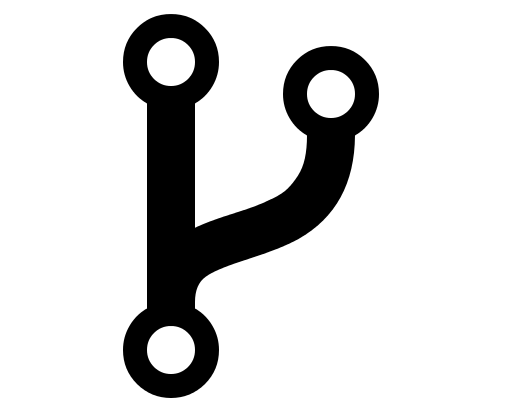
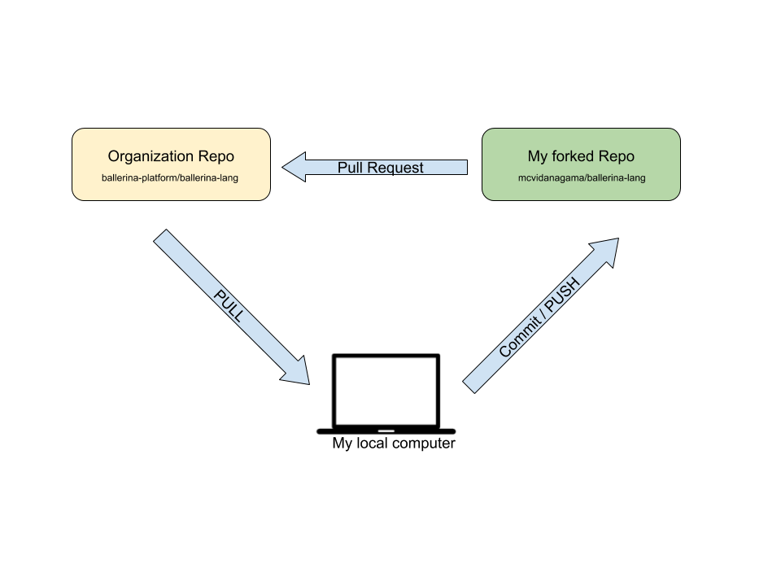

# Git!

> Git (/git/)[7] is a distributed version-control system for tracking changes in source code during software development.

# Table Of Contents

-   current problems
-   what is version control?
-   more about git
-   distributed vs centralized
-   how to use git
-   file status life cycle
-   Github
-   Push? Remote? Clone?
-   fork, PR, issue
-   .gitignore, .git
-   branch, merge
-   common commands

-   further read

# what do we do now? Manual version controlling by programmer


# problems

-   copy-paste/save-as whole project after every stable build
-   what if more than 1 developer work at the same time?
-   which version was stable?
-   all files are unnecessary while saving as?

# benefits of version control

-   easily management collaboration on a project
-   ability to have unlimited number of developers
-   easily revert back your files if something went wrong

# SVN (by Apache)


# Visual Studio Team Services code (by Microsoft)


# git (by Linus Torvalds)


# As of 2020, the 5.6 release of the Linux kernel had around 33 million lines of code.


# git features

-   free and open source
-   distributed
-   non-linear (branches)
-   handle large projects efficiently


# Centralized version control


# Distributed version control


# how to use git

1. search!
2. I search too
3. everybody else does search too

# file status life cycle


# Github

-   instagram for git

-   a place to keep git projects, review them, fork them, star them.

-   alternatives: gitlab, bitbucket, any other place

    

#### gist: some part of code to share with others

# Push? Remote? Clone?

-   remote: where should I upload my git projects
-   push: act of uploading gits
-   clone: download whole git
-   pull: check for updates in the remote git


# fork



# PR



# issue, issue template


# .gitignore, .git

-   .git: local and hidden folder that contains git internal files, don't open it!

-   delete .git folder in case of removing git from project

-   .gitignore: ignore these sort of files

```
*.class
.idea/
__pycache__/
```

Good site: [gitignore.io](https://www.gitignore.io/)

#### do not commit large and binary files! Why?

---

# branch


-

# merge


# merge conflict


### don't rewrite history (especially for published commits)

# common commands

```bash
# first time initialize
git config --global user.name "Bugs Bunny"
git config --global user.email bugs@gmail.com
git init


# regulary code and commit
git status
git add -A # or git add filename
git commit -m 'commit message'

# work with remote
git remote add origin https://github.com/your-account/your-repository.git
git push origin master # push from master branch to origin remote
git pull # get new updates
git clone https://github.com/sb-acc/some-repo.git

# see old commits (and other beautiful versions of this command)
git log
git log --abbrev-commit --pretty=oneline
git log --graph --oneline --decorate --abbrev-commit

# work with history
git checkout branchname # change HEAD to another commit/branch
git reset --hard HEAD # revert to last commit
git diff HEAD # what is changed from head
git checkout HEAD filename # revert filename to last commit

git blame filename # who changed this file

# stash
git stash # save uncommited changes and revert repository to commited sate
git stash list
git stash pop # pop last saved stash


# tag
git tag tagname -am 'tag message' # create new tag
git tag # list all tags
git push --tags


# merge
git config --global merge.tool meld # meld or another app
git checkout destination
git merge source
git mergetool # open the merge tool

rm -rf .git # get rid of git!
```

# further read

-   [Parsa's really good slides](http://slides.com/parsahejabi/git#/1)

-   [Amir's awesome slides](https://github.com/amirhallaji/My-Learning/tree/master/git)

-   [very good cheat sheet](https://github.com/arslanbilal/git-cheat-sheet)

-   [this Github io page](https://rachelcarmena.github.io/2018/12/12/how-to-teach-git.html)

-   [command by command explain](https://recompilermag.com/issues/issue-1/how-to-teach-git/)

-   [Jadi's videos](https://faradars.org/courses/fvgit9609-managed-distributed-edition-using-git)

-   [step by step](https://dont-be-afraid-to-commit.readthedocs.io/en/latest/git/commandlinegit.html)

-   [this good slide](https://courses.cs.washington.edu/courses/cse403/13au/lectures/git.ppt.pdf)

-   [tags](https://www.atlassian.com/git/tutorials/inspecting-a-repository/git-tag)

-   [git-scm](https://git-scm.com/)


Make PDF from this markdown file:

```bash
pandoc git.md -t beamer -o panc.pdf --pdf-engine=xelatex
```
